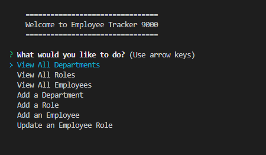

# Employee Tracker 9000

## Description
The Employee Tracker 9000 is a tool to manage employee and company records. The application maintains a database of tables for the company's departments, roles, and employees. With the application you can view the tables and records in detail. You can also create new departments, roles, and employee records and update existing employee records to change their job title/role.

## Installation
The user will need to download the code and install the following packages:
```
console.table
inquirer
mysql2
```

## Usage
With the code downloaded and the dependencies installed, the user starts the application with the command "node index" in the command terminal. The user can navigate the main menu with the up and down arrow keys, making their selection by pressing enter. When an option is selected to add a new department, role, employee, or to update an employee's role, the user follows the prompts to input the required information and make the selections accordingly.


</br>
</br>
[Demonstration Video](https://watch.screencastify.com/v/h4GZk2gsLvpCospAU3GP)
